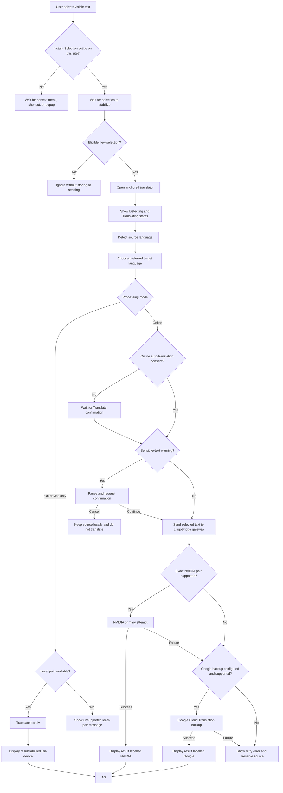
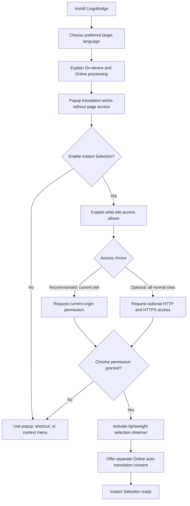
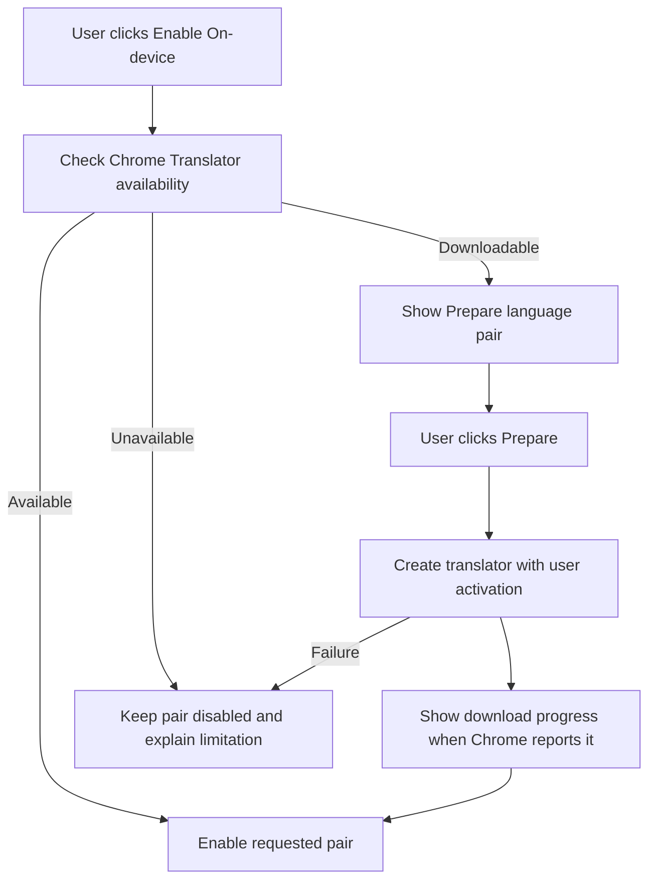
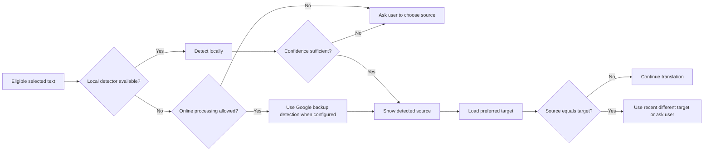
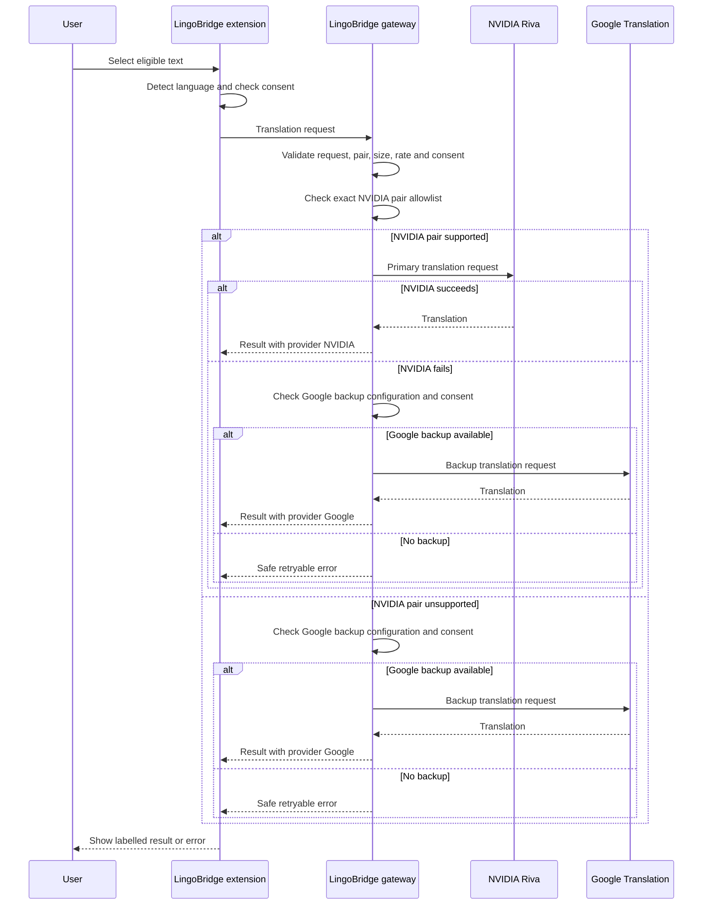
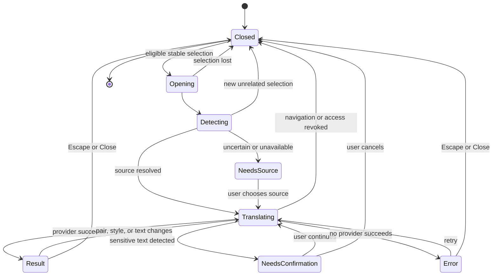
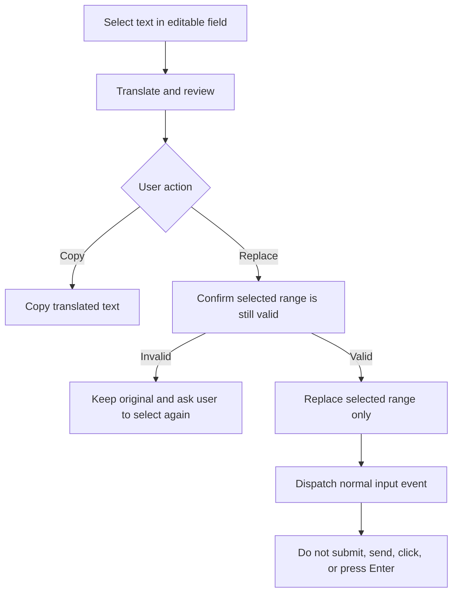
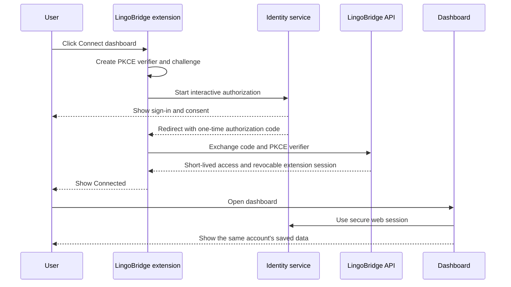
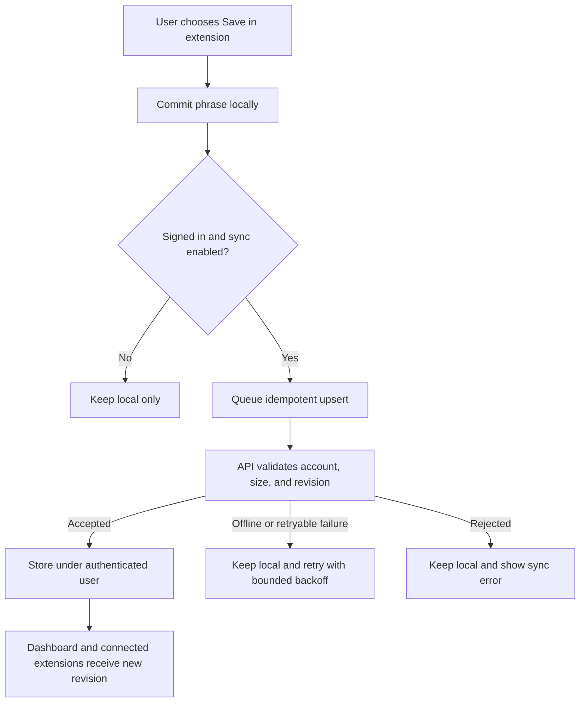
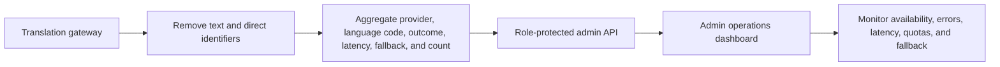

# User and system flows

Status: **Approved product flow; foundation complete and feature implementation pending**

## 1. Complete Instant Selection flow

## 2. Onboarding and permission flow

The permission and online-processing decisions are separate. Site access lets LingoBridge see the active selection; online consent controls whether eligible selected text may be sent automatically for translation.

## 2A. Explicit On-device preparation flow

LingoBridge does not promise a model-download size because Chrome does not expose one reliably. Preparing a pair never changes the user's Online preference or silently sends source text to a provider.

## 3. Selection eligibility flow

Before opening the translator, LingoBridge evaluates the active range in this order:

1. Confirm the event came from a completed pointer or keyboard selection action.
2. Wait briefly and verify that the selection is no longer changing.
3. Reject a collapsed or whitespace-only range.
4. Reject text beyond the configured character or byte limit.
5. Reject password fields, hidden content, extension UI, and unsupported browser pages.
6. Reject the same unchanged range if it was already handled.
7. Capture only the active selected text and its visible bounding rectangle.
8. Open one translator; never stack multiple panels.

## 4. Language detection and target flow

User correction always overrides automatic detection for the current translation.

## 5. Provider routing flow

Nepali requests never enter the selected NVIDIA adapter because `riva-translate-4b-instruct-v2` does not support Nepali. They require Google backup to be configured.

## 6. Anchored translator lifecycle

Scroll, resize, and zoom reposition the same surface without creating another translation request.

## 7. Translator surface flow

The anchored surface follows the reference layout in a compact form:

1. The top row contains detected source, swap, and target-language controls.
2. The source remains visible beside or above the translation, depending on available space.
3. The result area announces detecting, loading, success, warning, and failure states accessibly.
4. Copy copies only the translation.
5. Listen appears only where speech is supported.
6. Save stores the chosen source and translation locally.
7. Replace appears only for an editable selection and requires review.
8. Close removes the surface and temporary selection data.

## 8. Editable-field replacement flow

## 9. Capability-catalogue flow

1. Open the language picker immediately using the last-known-good local catalogue.
2. Ask the LingoBridge gateway for the current capability version.
3. Validate the response before replacing the local catalogue.
4. Enable NVIDIA only for reviewed exact pair tags.
5. Enable Google backup for current Google-supported directions when configured.
6. Gate speech, transliteration, styles, and on-device mode independently.
7. If refresh fails, keep the cached catalogue and mark it as stale.

## 10. Dismissal and cleanup flow

Temporary selection data is cleared when any of these occurs:

- the user presses Escape or Close;
- the user makes a new unrelated selection;
- the selected range disappears;
- the tab navigates or closes;
- site access is revoked;
- the five-minute maximum expiry is reached.

Saved phrases remain only when the user explicitly chooses Save. Closing the translator never creates history automatically.

## 11. Restricted and unsupported contexts

- Chrome internal pages, the Chrome Web Store, and other restricted schemes cannot host the automatic translator; use the popup instead.
- Canvas, WebGL, images, video text, and other non-selectable visual content are outside version 1.
- Closed Shadow DOM content may be unavailable to the selection observer.
- Cross-origin iframe behaviour depends on granted access and is tested separately.
- Missing or revoked access never triggers repeated permission prompts from a selection event.

## 12. Connect extension to dashboard

Translation remains available if the user skips, cancels, or later revokes dashboard connection.

## 13. Saved-phrase synchronization

Unsaved translation results never enter this flow.

## 14. Dashboard deletion and session revocation

1. Deleting one phrase creates a deletion revision and removes it from connected clients.
2. Delete all phrases requires explicit confirmation and does not delete the account.
3. Revoking an extension session invalidates that installation's next authenticated request.
4. Account deletion requires recent authentication and explicit confirmation.
5. Account deletion revokes all sessions, creates a deletion receipt, and starts the documented retention process.
6. The extension asks whether unsynchronized local phrases should remain or be deleted locally.

## 15. Admin operations flow

The admin path never receives selected text, translated text, saved phrases, access tokens, or provider secrets.
